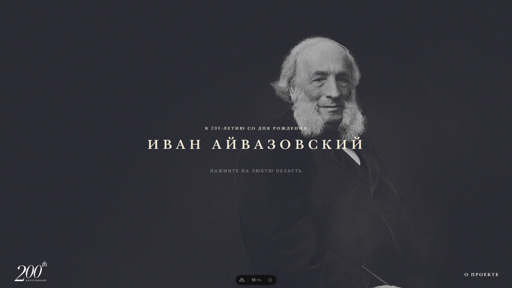

# Introduction

This project is dedicated to the 200th anniversary of the birth of Ivan Aivazovsky, a prominent Russian Romantic painter who is most famous for his seascapes. This repository contains various resources, including biographical information, artworks, and related historical context.



## Deployment
You can view the live version of this project at: https://ivanaivazovskiy.netlify.app

## Installation

Clone the repository
```bash 
git clone https://github.com/Arukenofu/IvanAivazovskiy.git
```

Navigate to the project directory
```bash
cd ivan-aivazovsky-main
```

Install dependencies
```bash
npm install
```

## Usage
After installing the dependencies, you can start the project by running:
```bash
npm run dev
```

Open your browser and go to http://localhost:3000 to view the project.

## Reference
Current application get reference by https://ivanaivazovsky.life/